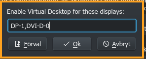
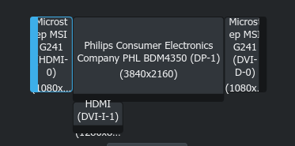

Selective Virtual Desktops
==========================

This script emulates having Virtual Desktops enabled __only__ on named displays. On all other displays, the windows will be shown on all desktops, effectively emulatating not having any Virtual Desktops for these displays.

If all you need is to enable Virtual Desktops __ONLY__ on primary monitor, and don't want to configure __anything__, I recommend simply using [Virtual Desktops Only On Primary](https://github.com/wsdfhjxc/kwin-scripts/tree/master/virtual-desktops-only-on-primary)

For many other use cases, this script will let you enable Virtual Desktops on more than one monitor, regardless of which monitor is primary. 

Configuration
=============
Configuration is very simple. Just add a comma separated list of displays that should be enabled for Virtual Desktops.



If you don't know the name of the display(s) you want to enable for Virtual Desktops, just look in System Settings. The names of all connected displays are shown as follows:



In the above example, the four displayes are named __HDMI-0__, __DP-1__, __DVI-D-0__ and __DVI-I-1__.

### IMPORTANT:

If you do __not__ see a button for configuration options, try the following:
```
mkdir -p ~/.local/share/kservices5
ln -fs ~/.local/share/kwin/scripts/selective-virtual-desktops/metadata.desktop ~/.local/share/kservices5/selective-virtual-desktops.desktop 
```

Copyright
=========
- License: [Gnu General Public License Version 3](LICENSE)
- Copyright &copy; 2021-2022 - Thomas Hellström <rel@xed.se>

